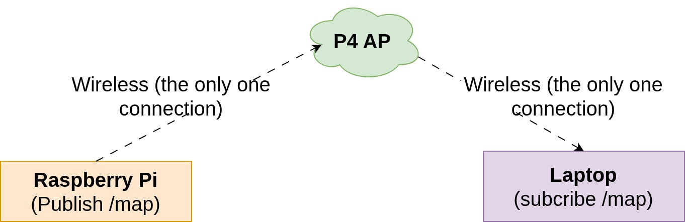
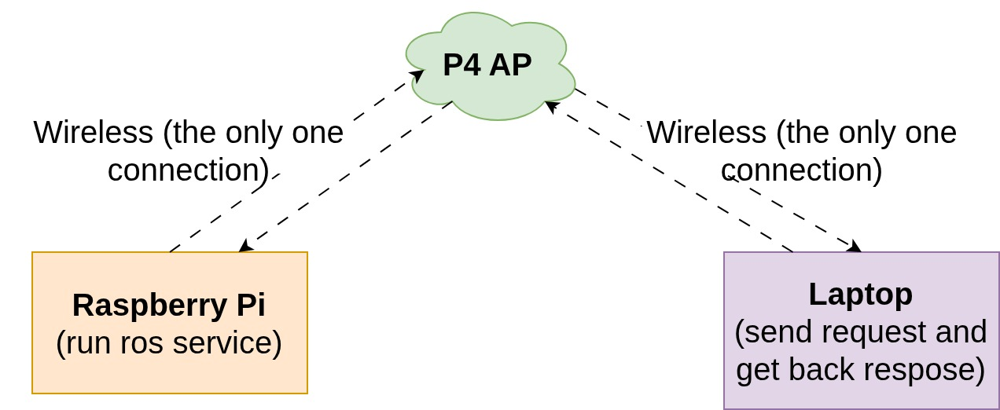

# simple-ros2-test

## Test 1
Set up the hardware as shown in the figure below:  


### Preparation (requires internet)
#### On Raspberry Pi:
Build the Docker image for the Publisher:
```bash
git clone https://github.com/PICOM-AI/simple-ros2-test.git
cd simple-ros2-test
bash 1.1.build_publisher.sh
```

#### On Laptop:
Build the Docker image for the Subscriber:
```bash
git clone https://github.com/PICOM-AI/simple-ros2-test.git
cd simple-ros2-test
bash 2.1.build_subscriber.sh
```

### Running the Test (internet not required)
#### On Raspberry Pi:
This publishes data to `/map` for 90 seconds. If it finishes, run the script again.

```bash
cd simple-ros2-test
bash 1.2.run_publisher.sh
```

#### On Laptop:
This should print a stream of messages to the CLI.

```bash
cd simple-ros2-test
bash 2.2.run_subscriber.sh
```

---

## Test 2
Set up the hardware as shown in the figure below:  


### Preparation (requires internet)
#### On Raspberry Pi:
Build the Docker image for the Service Server:
```bash
cd simple-ros2-test
bash 3.1.build_server.sh
```

#### On Laptop:
Build the Docker image for the Service Client:
```bash
cd simple-ros2-test
bash 4.1.build_client.sh
```

### Running the Test (internet not required)
#### On Raspberry Pi:
Start the service server:
```bash
cd simple-ros2-test
bash 3.2.run_server.sh
```

#### On Laptop:
Send a request to the server and get the result:
```bash
cd simple-ros2-test
bash 4.2.run_client.sh
```

Expected output if successful (no output means failure):
```
[INFO] [1762961239.313774629] [hello_client]: Result: 12
```

---

## Test 3
Set up the hardware as shown in the figure below:  


### Preparation (requires internet)
#### On Raspberry Pi:
Build the Docker image for the Socket Publisher:
```bash
cd simple-ros2-test
bash 5.1.build_socket_publisher.sh
```

#### On Laptop:
Build the Docker image for the Socket Subscriber:
```bash
cd simple-ros2-test
bash 6.1.build_socket_subscriber.sh
```

### Running the Test (internet not required)
#### On Raspberry Pi:
Start the socket server:
```bash
cd simple-ros2-test
bash 5.2.run_socket_publisher.sh
```

#### On Laptop:
Edit the script `6.2.run_socket_subscriber.sh` and replace:
```
SOCKET_SERVER_HOST="127.0.0.1"
```
with the Raspberry Pi IP address (VxLAN or P4 assigned).

Then run:
```bash
cd simple-ros2-test
bash 6.2.run_socket_subscriber.sh
```

Expected output if successful (no output means failure):
```
{"count": 308, "rand": "wX3zGSTx", "ts": 1762963811.2644305}
{"count": 309, "rand": "JSmiyOUO", "ts": 1762963812.264774}
```
